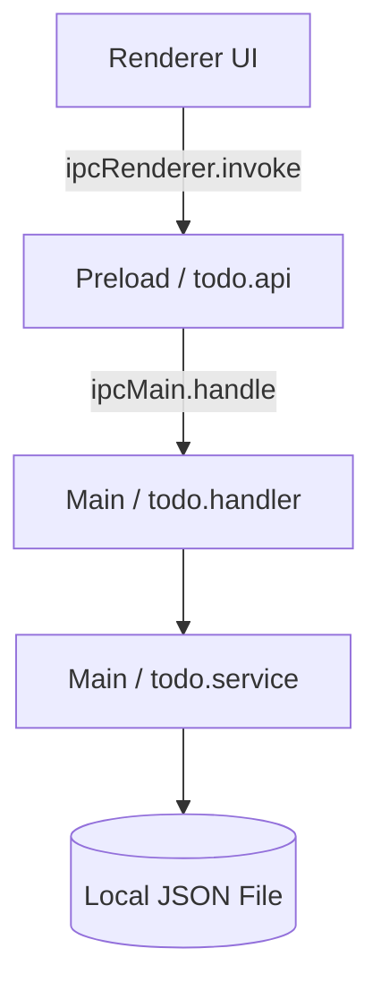

# ✨ Todo List — V1 Electron + Vanilla JS

> Branch `v1-vanilla` — [Back to main](../../tree/main)

Une application Todo List de bureau (Desktop) légère et visuellement saisissante, construite avec Electron.js. Elle dispose d'une Direction Artistique (DA) personnalisée de style "Holographic Dark Glass" pour une expérience utilisateur moderne.

---

## 🚀 Stack Technique

- **[Electron](https://www.electronjs.org/)** — Framework Desktop respectant une architecture 3-tiers stricte.
- **Frontend** — HTML / CSS (Glassmorphism & animations CSS) / JavaScript Vanilla.
- **Backend (Main Process)** — Node.js avec persistance des données via le module `fs`.

---

## 🛠️ Getting Started

L'intégralité du projet applicatif se situe dans le dossier `src/`.

> [!IMPORTANT]
> Le fichier de configuration `package.json` se trouve au sein du sous-répertoire `src/`. Vous devez vous y placer avant d'exécuter les commandes npm.

```bash
# 1. Naviguer dans le dossier source
cd src

# 2. Installer les dépendances
npm install

# 3. Lancer l'application
npm start
```

---

## ✨ Fonctionnalités (Features)

- **Esthétique Premium** : Interface en verre fumé (Glassmorphism), icônes vectorielles SVG animées, dégradés néons et formes flottantes en fond.
- **Gestion de Tâches** : Ajoutez facilement des tâches (clic ou `Entrée`), cochez/décochez, et supprimez.
- **Persistance des Données** : Les données sont persistées localement dans un fichier JSON (`userData/todo.json`). Vous retrouvez vos informations même après fermeture de l'application.

---

## 🏗️ Architecture Electron (3 Couches)

L'application suit scrupuleusement le modèle Electron afin de séparer les données sensibles de l'interface visuelle (Sandbox HTML stricte).

```text
src/
├── main/                            # Processus Principal (Node.js)
│   ├── index.js                     # Point d'entrée : crée la fenêtre (BrowserWindow)
│   ├── handlers/
│   │   └── todo.handler.js          # Écouteurs IPC (ipcMain.handle)
│   └── services/
│       ├── todo.service.js          # Logique métier CRUD
│       └── json.service.js          # Lecture / Écriture des données JSON
│
├── preload/                         # Pont de Sécurité (Preload Script)
│   ├── index.js                     # Expose les APIs sécurisées via contextBridge
│   └── apis/
│       └── todo.api.js              # Fonctions de relayage IPC (ipcRenderer.invoke)
│
└── renderer/                        # Processus de Rendu (Browser UI)
    ├── index.html                   # Point d'entrée HTML
    ├── main.js                      # Initialisation de l'application
    └── components/todo/
        ├── todo.component.js        # Logique d'interaction et événements
        ├── todo.template.js         # Intégration de la coquille HTML et des SVGs
        └── todo.style.css           # Styling complet "Holographic Dark Glass"
```

---

## 🔄 Flux de Données (Data Flow)

Lorsqu'une action est déclenchée par l'utilisateur (par exemple : ajouter une tâche), l'information circule à travers les couches de manière sécurisée :


